# Mapa Mental Hirly

Este mapa organiza o Hirly como produto, app, sistema de IA e operação. A ideia é servir como visão geral quando as funcionalidades começarem a parecer espalhadas.

## Como Ler Este Documento

O mapa separa tres niveis diferentes:

- **Produto**: o que o Hirly deve entregar para usuario e admin.
- **Sistema**: como dados, IA, match, tools e Firebase se conectam.
- **Roadmap**: o que ja existe, o que esta parcial e o que ainda deve ser implementado.

Legenda de status:

- **Implementado**: existe tela, service ou fluxo funcional no app.
- **Parcial**: existe base tecnica, mas ainda falta completar UX, persistencia, eval ou backend.
- **Planejado**: esta documentado como direcao, mas ainda nao deve ser tratado como pronto.

Regra de leitura: quando houver conflito entre ideia futura e estado atual do codigo, o estado atual do codigo vence.

## Visao Geral

```mermaid
mindmap
  root((Hirly))
    Produto
      Proposta
        App mobile de carreira para inicio de jornada
        Estagio
        Trainee
        Primeiro emprego
        Jovens brasileiros de 18 a 28 anos
      Promessa
        Descobrir vagas boas rapido
        Entender match com clareza
        Preparar candidatura melhor
        Reduzir perda de tempo
      Diferencial
        Feed vertical tipo TikTok
        Match deterministico
        IA explicavel
        CV estruturado
        Vagas com curadoria
        Agentes com tools seguras
    Usuario
      Onboarding
        Criar conta
        Enviar CV
        Revisar dados extraidos
        Escolher objetivo
        Escolher area
        Informar educacao
        Aceitar consentimento
      Perfil
        Dados pessoais
        Curso e universidade
        Skills
        Interesses
        Preferencias
        CV
        Confiabilidade do perfil
      Jornada
        Ver feed
        Curtir vagas
        Abrir detalhes
        Entender match
        Preparar candidatura
        Aplicar no site externo
        Acompanhar status
    Vagas
      Dados estruturados
        Empresa
        Cargo
        Senioridade
        Tipo de contrato
        Modalidade
        Localizacao
        Salario
        Requisitos
        Diferenciais
        Beneficios
        Link de candidatura
      Qualidade
        Fonte confiavel
        Empresa identificada
        Link valido
        Salario transparente
        Requisitos claros
        Sem red flags
        Freshness
      Admin
        Importar vagas
        Parsear texto bruto
        Detectar duplicatas
        Detectar golpe
        Revisar campos ausentes
        Aprovar
        Rejeitar
        Pausar
        Expirar
    Feed
      Experiencia
        Swipe vertical
        Card de vaga
        Double tap para curtir
        Pull to refresh
        Undo
        Filtros
        Empty states
      Ranking
        Match score
        Confiabilidade da vaga
        Frescor
        Diversidade
        Preferencias do usuario
        Red flags rebaixam
      Filtros
        Modalidade
        Salario
        Contrato
        Localizacao
        Ordenacao
    Match
      Calculo deterministico
        Modalidade
        Salario
        Localizacao
        Area
        Tipo de oportunidade
        Interesses
        Skills
      Explicacao por IA
        Pros
        Cons
        Veredito
        Evidencias
        Gaps
        Incertezas
      Melhorias
        Completar perfil
        Adicionar skills reais
        Ajustar CV
        Gerar pitch
        Treinar entrevista
    IA
      Principio
        IA estrutura
        Sistema valida
        Algoritmo calcula
        IA explica
        Usuario confirma
      Parsers
        Parser de CV
        Parser de vaga
        Normalizacao
        Schema validation
        Evidence
        Confidence
      Confiabilidade
        cvReliability
        jobReliability
        pairReliability
        Penalties
        Blockers
        Warnings
      Evals
        Job parser
        CV parser
        Safety
        Evidence
        Pitch
        Match explanation
        Salary insight
        Prompt injection
        Bias fairness
        Privacidade PII
      Embeddings
        Busca inteligente
        Vagas parecidas
        Similaridade CV vaga
        RAG para explicacao
      RAG
        Chunks do CV
        Chunks da vaga
        TopK evidencias
        Contexto limitado
        Resposta ancorada
    Agentes
      Tool calling
        IA interpreta intencao
        Chama tool com JSON
        App valida args
        App valida permissao
        Backend ou service executa
        IA responde
      Agente de Candidatura
        Buscar perfil
        Buscar CV parseado
        Buscar vagas
        Ranquear por match
        Selecionar 5 vagas
        Gerar plano semanal
        Pedir confirmacao
        Salvar plano
      Agente de CV
        Analisar perfil
        Sugerir melhorias
        Adaptar para vaga alvo
        Pedir aprovacao
        Aplicar alteracoes
      Agente Admin
        Buscar pendentes
        Detectar duplicatas
        Detectar risco
        Sugerir correcoes
        Mandar para revisao humana
      Agente Descoberta Diaria
        Selecionar vagas do dia
        Diversificar
        Evitar risco
        Explicar escolhas
      Agente Entrevista
        Gerar perguntas
        Gerar outlines
        Sugerir perguntas ao recrutador
    Tools
      Profile
        getUserProfile
        updateUserProfile
        getUserPreferences
        getUserReliability
      Resume
        parseResume
        validateParsedResume
        approveParsedResume
        suggestResumeImprovements
      Jobs
        searchJobs
        getSimilarJobs
        getRecommendedJobs
        saveJob
        reportJob
      Admin jobs
        parseJobFromText
        validateParsedJob
        detectJobRiskFlags
        calculateJobReliability
        approveJobForPublishing
      Match
        calculateMatchScore
        calculatePairReliability
        explainMatch
        suggestMatchImprovements
      Applications
        createApplicationPlan
        markJobAsApplied
        updateApplicationStatus
        saveApplicationTaskProgress
      Security
        checkUserPermission
        validateToolArguments
        requireUserConfirmation
        redactSensitiveData
    Candidatura
      Plano
        Readiness score
        Etapas
        Prioridades
        Tempo estimado
        Progresso
      Pitch
        Email
        WhatsApp
        Assunto
        Claims validados
      Tracker
        Aplicada
        Entrevista
        Desafio futuro
        Oferta
        Contratado
        Rejeitada
    Operacao
      Qualidade
        Evals automatizados
        Revisao humana
        Prompt versioning
        Analytics de IA
      Confiabilidade
        Logs de erro
        Cache
        Fallbacks
        Custo por feature
        Latencia
      Legal privacidade
        Termos de uso
        Politica de privacidade
        Consentimento
        Redacao de PII
        Disclaimers de candidatura externa
      Distribuicao
        App icon
        Splash
        Deep links
        Push notifications
        Sentry ou crash reporting
    Monetizacao
      B2C futuro
        Premium de candidatura
        Coach avançado
      B2B futuro
        Empresas
        Vagas patrocinadas
        Matching reverso
        Analytics
      Cuidados
        Nao vender promessa falsa
        Transparencia
        Privacidade
    Tecnico
      App
        Expo
        React Native
        TypeScript strict
        Firebase
      Firebase
        Auth
        Firestore
        Storage
      Services
        jobs
        cv
        match
        pitch
        applications
        agentTools
      Design
        Dark mode
        Premium
        Logo Hirly
        Cards de vaga
        Match badge
```



## Camadas Do Produto

### 1. Experiencia principal

O Hirly deve ser entendido primeiro como um app de descoberta e acao:

```txt
Usuário cria perfil
→ sobe CV
→ recebe vagas boas
→ entende o match
→ prepara candidatura
→ aplica
→ acompanha progresso
```

Tudo que nao melhora uma dessas etapas deve ser tratado como secundario.

### 2. Camada de dados

O app depende de dois objetos principais:

- `UserProfile`: quem e o usuario, o que ele busca, quais evidencias ele tem.
- `Job`: o que e a vaga, de onde veio, quao confiavel ela e.

O objetivo da IA nesta camada e transformar dados baguncados em dados estruturados:

```txt
CV bruto -> Candidate JSON -> validacao -> perfil revisado
Vaga bruta -> Job JSON -> validacao -> revisao admin -> publicacao
```

### 3. Camada de confiabilidade

Antes de usar IA para convencer o usuario, o sistema precisa saber se os dados sao confiaveis.

Scores principais:

- `cvReliability`: confiabilidade do CV/perfil.
- `jobReliability`: confiabilidade da vaga.
- `pairReliability`: confiabilidade da combinacao perfil-vaga.

Uso pratico:

- Vaga pouco confiavel nao deve subir no feed.
- Pitch nao deve usar claims sem evidencia.
- Explicacao de match deve ser cautelosa quando a confiabilidade for baixa.
- Admin deve revisar vagas abaixo do threshold.

### 4. Camada de match

O match deve continuar deterministico.

Entradas:

- modalidade;
- salario;
- localizacao;
- area;
- tipo de oportunidade;
- interesses;
- skills;
- confiabilidade;
- futuramente similaridade semantica.

A IA entra depois:

```txt
Sistema calcula score
→ sistema gera breakdown
→ IA transforma breakdown em explicacao humana
→ eval checa alucinacao
```

### 5. Camada de agentes

Agentes nao devem ser "chatbots soltos". Eles devem ser orquestradores de tools.

Regra:

```txt
IA decide intenção
→ chama tool
→ app/backend valida argumentos e permissao
→ service ou Cloud Function executa
→ IA resume resultado
```

Acoes que alteram estado precisam:

- confirmacao;
- resumo;
- permissao;
- possibilidade de edicao.

No estado atual, a camada `agentTools` vive no app e serve como contrato interno. Para producao, tools sensiveis de escrita/admin devem migrar para Cloud Functions ou backend equivalente.

### 6. Camada de operacao

Essa camada impede que o produto vire uma demo bonita mas fragil.

Inclui:

- monitorar erro, custo e latencia de IA;
- registrar versao de prompt/modelo;
- rodar evals antes de trocar prompt ou modelo;
- proteger dados sensiveis do CV;
- manter termos, privacidade e disclaimers claros;
- acompanhar crash/performance quando for para loja.

## Jornadas Principais

### Jornada 1: Usuario novo

```txt
Criar conta
→ subir CV
→ IA parseia CV
→ usuario revisa
→ salvar perfil
→ feed personalizado
```

Features envolvidas:

- Auth;
- CV upload;
- parser de CV;
- profile completeness;
- feed;
- match score.

### Jornada 2: Descobrir vaga boa

```txt
Abrir feed
→ ver card
→ entender salario/modalidade/match
→ curtir ou pular
→ abrir detalhe
```

Features envolvidas:

- Feed;
- JobCard;
- filtros;
- ranking;
- match badge;
- liked jobs.

### Jornada 3: Entender uma vaga

```txt
Abrir detalhe
→ ver score
→ IA explica match
→ mostra pros, cons e gaps
→ usuario decide proximo passo
```

Features envolvidas:

- JobDetail;
- computeMatchScore;
- matchExplainer;
- evidence;
- pairReliability.

### Jornada 4: Preparar candidatura

```txt
Usuario escolhe vaga
→ app cria plano
→ usuario gera pitch
→ simula fit
→ treina entrevista
→ aplica no site externo
→ marca como aplicada
```

Features envolvidas:

- ApplicationPlan;
- Pitch;
- Fit analysis;
- Mock interview;
- Applications tracker.

Observacao: o tracker atual cobre aplicada, entrevista, oferta, contratado e rejeitada. Status como "desafio" pode entrar depois, mas ainda deve ser tratado como evolucao futura.

### Jornada 5: Admin publica vagas

```txt
Admin cola texto bruto
→ IA parseia
→ sistema valida campos
→ sistema calcula risco
→ admin revisa
→ publica ou rejeita
```

Features envolvidas:

- AdminJobAdd;
- jobParser;
- jobQuality;
- curationStatus;
- riskFlags;
- future admin agent.

## O Que Ja Existe

### Implementado no app

- Auth;
- onboarding;
- upload de CV;
- parser de CV;
- parser de vaga;
- feed vertical;
- filtros;
- match score deterministico;
- detalhes da vaga;
- curtidas;
- candidaturas;
- pitch;
- CV coach;
- salario insight;
- vagas do dia;
- plano de candidatura;
- aumentar match;
- mock interview;
- admin de vagas;
- camada de `agentTools`.

Observacao: "implementado" aqui significa que existe base funcional no codigo. Algumas features ainda podem precisar de polimento visual, evals, fallback ou fluxo mais completo antes de producao.

### Documentado

- evals;
- schemas canônicos;
- enums;
- evidence;
- confiabilidade complexa;
- embeddings/RAG;
- agentes.

### Parcialmente implementado

- confiabilidade simplificada em `agentTools`;
- schema canônico central em runtime;
- evidence por campo em novos parses de vaga/CV;
- cálculo real de confiabilidade para CV, vaga e par CV-vaga;
- eval runner determinístico para parser de vaga, safety, CV, pitch e match explanation;
- tools internas;
- admin review;
- IA em services separados.
- analytics basico;
- legal/docs internas;
- app icon/splash antigos ainda nao substituidos pela marca final.

### Ainda nao implementado

- embeddings reais;
- busca semântica;
- RAG real para match explanation;
- Agent Runner;
- UI dos agentes;
- Cloud Functions para tools sensiveis.
- push notifications;
- deep links reais em dominio final;
- crash reporting/observabilidade;
- aplicacao da logo final no app icon, splash e header.

## Prioridade Recomendada

### Fase 1: Arrumar fundacao

1. Criar schemas canônicos de vaga e CV.
2. Criar `reliability.ts` com calculo real.
3. Persistir `evidence` nos outputs de parser.
4. Melhorar admin review com confiabilidade e red flags.
5. Aplicar logo final no app icon, splash e header.
6. Separar claramente status atual vs futuro no tracker de candidaturas.

### Fase 2: IA confiavel no usuario

1. Match explanation com evidence.
2. Pitch com validacao de claims.
3. CV coach com sugestoes aprovaveis.
4. Application plan mais integrado ao tracker.
5. Fallbacks claros para IA sem credito, timeout ou schema invalido.

### Fase 3: Busca e descoberta inteligente

1. Normalizar skills/cargos/areas.
2. Gerar embeddings de vagas.
3. Busca semantica.
4. Vagas parecidas.
5. Similaridade semantica como sinal auxiliar.

### Fase 4: Agentes

1. Agent Runner.
2. Agente Admin de Vagas.
3. Agente de CV.
4. Agente de Candidatura.
5. Agente de Descoberta Diaria.
6. Agente de Entrevista.

### Fase 5: Qualidade e escala

1. Evals automatizados.
2. Prompt/version tracking.
3. Analytics de IA.
4. Cloud Functions para actions sensiveis.
5. Monitoramento de custo/latencia.
6. Push notifications e deep links reais.
7. Crash reporting.

## Ordem Das Dependencias

Esta ordem ajuda a evitar construir feature avancada em cima de dados fracos:

```txt
Schemas canônicos
→ normalização
→ evidence
→ reliability
→ match determinístico
→ explicação com IA
→ evals
→ embeddings
→ RAG
→ agentes
→ automações/notificações
```

Se uma etapa posterior parecer confusa, provavelmente falta fortalecer uma etapa anterior.

## Decisoes Guia

- IA nao decide sozinha; IA auxilia.
- Match final deve ser deterministico.
- Toda recomendacao importante precisa de evidencia.
- Toda escrita no Firebase precisa de validacao e confirmacao.
- Vaga ruim destrói o produto; admin/curadoria vem antes de agentes sofisticados.
- CV inventado destrói confianca; parser precisa ser conservador.
- Embeddings melhoram descoberta, mas nao substituem filtros.
- RAG melhora explicacao, mas depende de dados estruturados.
- Agentes so fazem sentido depois de tools pequenas e seguras.
- Produto deve priorizar clareza sobre quantidade de features.
- Cada nova IA precisa ter fallback, custo estimado e criterio de qualidade.
